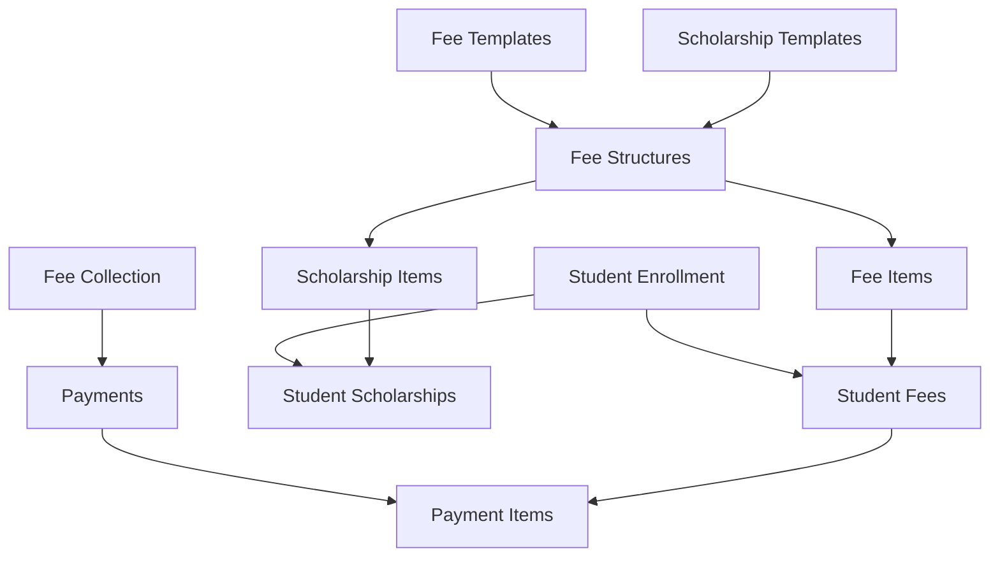

# Flexible Fee Structure System Design

## 📋 Overview

This document outlines the design and implementation plan for a comprehensive flexible fee structure system that replaces the current rigid fee management approach. The new system allows administrators to create custom fee types, define different fee structures for each academic year and class combination, implement sophisticated scholarship systems, and provide granular control over fee editability during student enrollment.

## 🎯 Business Requirements

### Current System Limitations
- ❌ **Fixed Fee Types**: Only supports hardcoded fees (tuition, book, uniform, islamic studies, van, scholarship)
- ❌ **No Configurability**: Admin cannot define custom fee types or structures
- ❌ **Basic Scholarship**: Single negative value field without configurability per academic year/class
- ❌ **No Editability Control**: No way to mark fees as editable vs fixed during enrollment
- ❌ **Rigid Structure**: Same fee structure for all classes in an academic year

### New System Goals
- ✅ **Custom Fee Types**: Admin can create unlimited fee types with categories
- ✅ **Academic Year + Class Specific**: Different fee structures per year and class
- ✅ **Configurable Scholarships**: Fixed scholarship amounts configurable per academic year and class
- ✅ **Enrollment Flexibility**: Granular control over which fees can be edited during enrollment
- ✅ **Audit Trail**: Complete history of fee changes and payments
- ✅ **Scalability**: Easy to add new fee types without code changes

---

## 🏗️ System Architecture

### Core Components Overview



### 1. Fee Templates (Master Data)
**Purpose**: Define available fee types that can be used across the system

| Field | Type | Description |
|-------|------|-------------|
| `id` | ObjectId | Primary key |
| `name` | String | Fee name (e.g., "School Fee", "Transport Fee") |
| `description` | String | Detailed description |
| `category` | Enum | REGULAR, OPTIONAL, ACTIVITY, EXAMINATION, LATE_FEE |
| `isActive` | Boolean | Whether this template can be used |
| `order` | Number | Display order in UI |

**Examples**:
- School Fee (REGULAR)
- Book Fee (REGULAR) 
- Uniform Fee (OPTIONAL)
- Transport Fee (OPTIONAL)
- Library Fee (ACTIVITY)
- Lab Fee (ACTIVITY)
- Late Payment Fee (LATE_FEE)

### 2. Fee Structures (Configuration per Academic Year + Class)
**Purpose**: Define fee configuration for specific academic year and class combination

| Field | Type | Description |
|-------|------|-------------|
| `academicYearId` | ObjectId | Reference to academic year |
| `classId` | ObjectId | Reference to class |
| `name` | String | Structure name (e.g., "Class 1 - 2024-25") |
| `description` | String | Optional description |
| `isActive` | Boolean | Whether this structure is active |

**Business Rules**:
- One fee structure per Academic Year + Class combination
- Admin creates these at the beginning of each academic year
- Contains multiple fee items and scholarship options

### 3. Fee Items (Actual Fee Amounts)
**Purpose**: Define specific fee amounts within a fee structure

| Field | Type | Description |
|-------|------|-------------|
| `feeStructureId` | ObjectId | Parent fee structure |
| `feeTemplateId` | ObjectId | Reference to fee template |
| `amount` | Float | Fee amount in rupees |
| `isCompulsory` | Boolean | Whether this fee is mandatory |
| `isEditableDuringEnrollment` | Boolean | Can be modified during enrollment |
| `order` | Number | Display order |

**Example for Class 1 - 2024-25**:
```json
[
  {
    "feeTemplate": "School Fee",
    "amount": 12000,
    "isCompulsory": true,
    "isEditableDuringEnrollment": false
  },
  {
    "feeTemplate": "Transport Fee", 
    "amount": 6000,
    "isCompulsory": false,
    "isEditableDuringEnrollment": true
  }
]
```

### 4. Scholarship System (Simplified)

#### Scholarship Templates (Master Data)
**Purpose**: Define available scholarship types that can be used across the system

| Field | Type | Description |
|-------|------|-------------|
| `id` | ObjectId | Primary key |
| `name` | String | Scholarship name (e.g., "Merit Scholarship", "Need-based") |
| `description` | String | Detailed description |
| `type` | Enum | MERIT, NEED_BASED, GOVERNMENT, SPORTS, MINORITY, GENERAL |
| `isActive` | Boolean | Whether this template can be used |
| `order` | Number | Display order in UI |

**Examples**:
- Merit Scholarship (MERIT)
- Need-based Scholarship (NEED_BASED)
- Government Scholarship (GOVERNMENT)
- Sports Scholarship (SPORTS)
- General Scholarship (GENERAL)

#### Scholarship Items (Per Fee Structure)
**Purpose**: Define specific scholarship amounts within a fee structure

| Field | Type | Description |
|-------|------|-------------|
| `feeStructureId` | ObjectId | Parent fee structure |
| `scholarshipTemplateId` | ObjectId | Reference to scholarship template |
| `amount` | Float | Scholarship amount (applied as negative) |
| `isAutoApplied` | Boolean | Whether applied automatically during enrollment |
| `order` | Number | Display order |

**Business Rules**:
- Multiple scholarships can be defined per fee structure
- Each scholarship has a fixed amount (no complex rules)
- Can be marked as auto-applied or manually selectable
- Applied as negative amounts in calculations

**Example for Class 1 - 2024-25**:
```json
[
  {
    "scholarshipTemplate": "Merit Scholarship",
    "amount": 2000,
    "isAutoApplied": false
  },
  {
    "scholarshipTemplate": "Government Scholarship",
    "amount": 1500,
    "isAutoApplied": true
  }
]
```

### 5. Student-Level Data

#### Student Fees
**Purpose**: Individual fee amounts for each enrolled student (copied from fee structure)

| Field | Type | Description |
|-------|------|-------------|
| `studentYearId` | ObjectId | Student enrollment record |
| `feeItemId` | ObjectId | Reference to fee item |
| `amount` | Float | Student's fee amount (can be customized) |
| `amountPaid` | Float | Amount paid so far |
| `isWaived` | Boolean | Whether fee is waived |
| `waivedReason` | String | Reason if waived |

#### Student Scholarships
**Purpose**: Track scholarships applied to individual students

| Field | Type | Description |
|-------|------|-------------|
| `studentYearId` | ObjectId | Student enrollment record |
| `scholarshipItemId` | ObjectId | Reference to scholarship item |
| `amount` | Float | Applied scholarship amount (can be customized) |
| `appliedDate` | DateTime | When scholarship was applied |
| `appliedBy` | String | Who applied the scholarship |
| `isActive` | Boolean | Whether scholarship is currently active |

**Business Rules**:
- Students can have multiple scholarships applied
- Scholarship amounts can be customized per student
- Auto-applied scholarships are added during enrollment
- Manual scholarships can be added/removed by staff

---

## 🔄 Key Workflows

### 1. Admin Setup Workflow

#### Step 1: Create Fee Templates (One-time setup)
```typescript
// Admin creates reusable fee templates
const templates = [
  { name: "School Fee", category: "REGULAR" },
  { name: "Book Fee", category: "REGULAR" },
  { name: "Uniform Fee", category: "OPTIONAL" },
  { name: "Transport Fee", category: "OPTIONAL" },
  { name: "Library Fee", category: "ACTIVITY" }
]
```

#### Step 2: Setup Fee Structure for Academic Year + Class
```typescript
// For each class in new academic year
const feeStructure = {
  academicYearId: "2024-25",
  classId: "class-1",
  name: "Class 1 - 2024-25 Fee Structure",
  feeItems: [
    {
      feeTemplateId: "school-fee",
      amount: 12000,
      isCompulsory: true,
      isEditableDuringEnrollment: false
    },
    {
      feeTemplateId: "transport-fee", 
      amount: 6000,
      isCompulsory: false,
      isEditableDuringEnrollment: true
    }
  ]
}
```

#### Step 3: Configure Scholarships (Optional)
```typescript
// Add scholarship items to fee structure
const scholarshipItems = [
  {
    feeStructureId: feeStructure.id,
    scholarshipTemplateId: "merit-scholarship-template",
    amount: 2000,
    isAutoApplied: false // Manual selection
  },
  {
    feeStructureId: feeStructure.id,
    scholarshipTemplateId: "government-scholarship-template", 
    amount: 1500,
    isAutoApplied: true // Auto-applied during enrollment
  }
]
```

### 2. Student Enrollment Workflow

#### Step 1: Load Fee Structure
```typescript
// When admin selects academic year + class
const feeStructure = await getFeeStructure(academicYearId, classId)
// Returns all fee items with amounts and editability rules
```

#### Step 2: Apply Default Fees
```typescript
// Copy fee structure to student fees
const studentFees = feeStructure.feeItems.map(item => ({
  studentYearId: enrollment.id,
  feeItemId: item.id,
  amount: item.amount, // Default amount from structure
  amountPaid: 0
}))
```

#### Step 3: Customize Editable Fees
```typescript
// Staff can modify fees marked as editable
if (feeItem.isEditableDuringEnrollment) {
  studentFee.amount = customAmount // Allow modification
}
```

#### Step 4: Apply Scholarships
```typescript
// Auto-apply scholarships marked as isAutoApplied
const autoScholarships = feeStructure.scholarshipItems
  .filter(item => item.isAutoApplied)

for (const scholarshipItem of autoScholarships) {
  await createStudentScholarship({
    studentYearId: enrollment.id,
    scholarshipItemId: scholarshipItem.id,
    amount: scholarshipItem.amount,
    appliedBy: session.user.username,
    isActive: true
  })
}

// Staff can manually add other available scholarships during enrollment
```

### 3. Fee Collection Workflow

#### Step 1: Load Student Fee Details
```typescript
const feeDetails = await getStudentFeeDetails(studentYearId)
// Returns all fees with total, paid, outstanding amounts
```

#### Step 2: Flexible Payment
```typescript
// Admin can pay specific fees partially or fully
const payment = {
  studentYearId,
  paymentItems: [
    { feeItemId: "school-fee", amount: 5000 },
    { feeItemId: "book-fee", amount: 3000 }
  ],
  totalAmount: 8000
}
```

#### Step 3: Update Records
```typescript
// Update student fees and create payment records
await updateStudentFeesPaid(payment.paymentItems)
await createPaymentRecord(payment)
```

---

## 🗄️ MongoDB-Optimized Database Schema Design

> **Note:** This schema is designed for MongoDB with denormalization to optimize query performance based on common access patterns. The design embeds related data to minimize lookups and leverages Prisma composite types for type safety.

### Core Design Principles for MongoDB

1. **Query-First Design**: Schema optimized for most frequent queries
2. **Denormalization**: Embed related data to reduce lookup operations
3. **Single Document Retrieval**: Most operations require only one database query
4. **Atomic Updates**: Related data updates happen within single documents
5. **Indexing Strategy**: Compound indexes for common query patterns

---

### 1. **Fee Templates** (Reference Data - Normalized)
*Low update frequency, referenced across many structures*

```typescript
// Collection: fee_templates
{
  id: ObjectId,
  name: string,           // "School Fee", "Transport Fee"
  description?: string,
  category: "REGULAR" | "OPTIONAL" | "ACTIVITY" | "EXAMINATION" | "LATE_FEE",
  isActive: boolean,
  order: number,
  createdAt: DateTime,
  updatedAt: DateTime
}
```

**Query Pattern**: Rarely queried independently, mostly used for reference
**Indexing**: `{ isActive: 1, order: 1 }`

---

### 2. **Scholarship Templates** (Reference Data - Normalized)
*Low update frequency, referenced across many structures*

```typescript
// Collection: scholarship_templates
{
  id: ObjectId,
  name: string,           // "Merit Scholarship", "Government Scholarship"
  description?: string,
  type: "MERIT" | "NEED_BASED" | "GOVERNMENT" | "SPORTS" | "MINORITY" | "GENERAL",
  isActive: boolean,
  order: number,
  createdAt: DateTime,
  updatedAt: DateTime
}
```

**Query Pattern**: Rarely queried independently, mostly used for reference
**Indexing**: `{ isActive: 1, order: 1 }`

---

### 3. **Fee Structures** (Denormalized - Single Document)
*Complete fee configuration for academic year + class combination*

```typescript
// Collection: fee_structures
{
  id: ObjectId,
  
  // Basic Information
  academicYearId: ObjectId,
  classId: ObjectId,
  name: string,           // "Class 1 - 2024-25"
  description?: string,
  isActive: boolean,
  
  // Denormalized Academic Year Info (for reporting queries)
  academicYear: {
    year: string,         // "2024-25"
    startDate: DateTime,
    endDate: DateTime,
    isActive: boolean
  },
  
  // Denormalized Class Info (for reporting queries)
  class: {
    className: string,    // "Class 1"
    order: number,
    isActive: boolean
  },
  
  // Embedded Fee Items (Denormalized with template data)
  feeItems: [
    {
      id: ObjectId,                           // Unique ID for this fee item
      templateId: ObjectId,                   // Reference to fee_template
      templateName: string,                   // Denormalized for queries
      templateCategory: "REGULAR" | "OPTIONAL" | "ACTIVITY" | "EXAMINATION" | "LATE_FEE",
      amount: number,
      isCompulsory: boolean,
      isEditableDuringEnrollment: boolean,
      order: number
    }
  ],
  
  // Embedded Scholarship Items (Denormalized with template data)
  scholarshipItems: [
    {
      id: ObjectId,                           // Unique ID for this scholarship item
      templateId: ObjectId,                   // Reference to scholarship_template
      templateName: string,                   // Denormalized for queries
      templateType: "MERIT" | "NEED_BASED" | "GOVERNMENT" | "SPORTS" | "MINORITY" | "GENERAL",
      amount: number,
      isAutoApplied: boolean,
      isEditableDuringEnrollment: boolean,
      order: number
    }
  ],
  
  // Computed Fields (for quick queries)
  totalFees: {
    compulsory: number,     // Sum of all compulsory fees
    optional: number,       // Sum of all optional fees
    total: number          // Total of all fees
  },
  
  totalScholarships: {
    autoApplied: number,    // Sum of auto-applied scholarships
    manual: number,         // Sum of manual scholarships
    total: number          // Total of all scholarships
  },
  
  createdAt: DateTime,
  updatedAt: DateTime
}
```

**Primary Query Patterns**:
- `getFeeStructure(academicYearId, classId)` - Single document lookup
- Admin setup and configuration
- Fee structure copying

**Indexing**:
- `{ academicYearId: 1, classId: 1 }` (unique compound index)
- `{ isActive: 1, "academicYear.year": 1 }`
- `{ "class.order": 1, "academicYear.year": 1 }`

**Benefits of Denormalization**:
- Complete fee structure retrieved in single query
- Template data embedded for immediate access
- Computed totals available without aggregation
- Efficient for admin configuration screens

---

### 4. **Student Enrollments** (Highly Denormalized)
*Student enrollment with complete fee and scholarship details*

```typescript
// Collection: student_enrollments
{
  id: ObjectId,
  
  // Basic Enrollment Info
  studentId: ObjectId,
  academicYearId: ObjectId,
  classId: ObjectId,
  section: string,
  enrollmentDate: DateTime,
  isActive: boolean,
  
  // Denormalized Student Info (for queries without lookup)
  student: {
    admissionNumber: string,
    firstName: string,
    lastName: string,
    fatherName: string,
    phone: string,
    class: string,          // Current class name
    status: "ACTIVE" | "INACTIVE" | "GRADUATED" | "TRANSFERRED"
  },
  
  // Denormalized Academic Year & Class Info
  academicYear: {
    year: string,
    startDate: DateTime,
    endDate: DateTime
  },
  
  class: {
    className: string,
    order: number
  },
  
  // Student-Specific Fees (copied from fee structure + customizations)
  fees: [
    {
      id: ObjectId,                           // Unique fee ID for this student
      feeItemId: ObjectId,                    // Reference to fee structure's feeItem
      templateId: ObjectId,                   // Fee template reference
      templateName: string,                   // Denormalized template name
      templateCategory: "REGULAR" | "OPTIONAL" | "ACTIVITY" | "EXAMINATION" | "LATE_FEE",
      amount: number,                         // Can be customized from default
      originalAmount: number,                 // Original amount from structure
      amountPaid: number,                     // Total paid so far
      amountDue: number,                      // Calculated: amount - amountPaid
      isCompulsory: boolean,
      order: number,
      
      // Payment History Embedded (for quick access)
      recentPayments: [                       // Last 5 payments for this fee
        {
          paymentId: ObjectId,
          amount: number,
          paymentDate: DateTime,
          receiptNo: string,
          paymentMethod: "CASH" | "ONLINE" | "CHEQUE"
        }
      ]
    }
  ],
  
  // Applied Scholarships (with details)
  scholarships: [
    {
      id: ObjectId,                           // Unique scholarship ID for this student
      scholarshipItemId: ObjectId,            // Reference to fee structure's scholarshipItem
      templateId: ObjectId,                   // Scholarship template reference
      templateName: string,                   // Denormalized template name
      templateType: "MERIT" | "NEED_BASED" | "GOVERNMENT" | "SPORTS" | "MINORITY" | "GENERAL",
      amount: number,                         // Applied amount (can be customized)
      originalAmount: number,                 // Original amount from structure
      isAutoApplied: boolean,
      appliedDate: DateTime,
      appliedBy: string,
      isActive: boolean,
      remarks?: string
    }
  ],
  
  // Computed Totals (updated on each fee/scholarship change)
  totals: {
    fees: {
      compulsory: number,
      optional: number,
      total: number,
      paid: number,
      due: number
    },
    scholarships: {
      applied: number,
      autoApplied: number,
      manual: number
    },
    netAmount: {
      total: number,        // fees.total - scholarships.applied
      paid: number,
      due: number          // total - paid
    }
  },
  
  // Fee Status Summary (for quick dashboard queries)
  feeStatus: {
    status: "PAID" | "PARTIAL" | "OVERDUE" | "WAIVED",
    lastPaymentDate?: DateTime,
    nextDueDate?: DateTime,
    overdueAmount: number
  },
  
  createdAt: DateTime,
  updatedAt: DateTime
}
```

**Primary Query Patterns**:
- `getStudentFeeDetails(studentEnrollmentId)` - Single document lookup
- `getOutstandingFees()` - Query by feeStatus and totals
- Student fee collection interface
- Fee reports by student/class/year

**Indexing**:
- `{ studentId: 1, academicYearId: 1 }` (unique compound)
- `{ academicYearId: 1, classId: 1, "feeStatus.status": 1 }`
- `{ "student.admissionNumber": 1 }`
- `{ "feeStatus.status": 1, "totals.netAmount.due": -1 }`
- `{ "student.firstName": 1, "student.lastName": 1 }` (text search)

**Benefits of Denormalization**:
- Complete student fee details in single query
- Embedded payment history for quick access
- Pre-computed totals eliminate aggregation queries
- Student info embedded for reports without joins
- Fee status pre-calculated for dashboard queries

---

### 5. **Payment Records** (Moderately Denormalized)
*Payment transactions with embedded details*

```typescript
// Collection: payments
{
  id: ObjectId,
  
  // Payment Info
  receiptNo: string,
  studentEnrollmentId: ObjectId,
  totalAmount: number,
  paymentDate: DateTime,
  paymentMethod: "CASH" | "ONLINE" | "CHEQUE",
  remarks?: string,
  createdBy: string,
  
  // Denormalized Student Info (for receipt generation)
  student: {
    admissionNumber: string,
    firstName: string,
    lastName: string,
    fatherName: string,
    class: string,
    section: string
  },
  
  // Denormalized Academic Year
  academicYear: {
    year: string
  },
  
  // Payment Breakdown (embedded)
  paymentItems: [
    {
      id: ObjectId,
      feeId: ObjectId,                        // Reference to student enrollment fee
      feeTemplateId: ObjectId,
      feeTemplateName: string,                // Denormalized for receipts
      amount: number,
      feeBalance: number                      // Balance after this payment
    }
  ],
  
  // Payment Status
  status: "COMPLETED" | "PENDING" | "CANCELLED",
  
  createdAt: DateTime,
  updatedAt: DateTime
}
```

**Primary Query Patterns**:
- Payment receipt generation
- Payment history by student
- Payment reports by date/method

**Indexing**:
- `{ receiptNo: 1 }` (unique)
- `{ studentEnrollmentId: 1, paymentDate: -1 }`
- `{ paymentDate: -1, paymentMethod: 1 }`
- `{ "student.admissionNumber": 1, paymentDate: -1 }`

---

### Prisma Schema with Composite Types

```prisma
// Fee Structure with embedded items
model FeeStructure {
  id            String   @id @default(auto()) @map("_id") @db.ObjectId
  academicYearId String  @db.ObjectId
  classId       String   @db.ObjectId
  name          String
  description   String?
  isActive      Boolean  @default(true)
  
  // Embedded composite types
  academicYear  AcademicYearInfo
  class         ClassInfo
  feeItems      FeeItem[]
  scholarshipItems ScholarshipItem[]
  totalFees     FeeTotals
  totalScholarships ScholarshipTotals
  
  createdAt DateTime @default(now())
  updatedAt DateTime @updatedAt
  
  @@unique([academicYearId, classId])
  @@map("fee_structures")
}

// Composite types for embedded documents
type AcademicYearInfo {
  year      String
  startDate DateTime
  endDate   DateTime
  isActive  Boolean
}

type ClassInfo {
  className String
  order     Int
  isActive  Boolean
}

type FeeItem {
  id                           String  @db.ObjectId
  templateId                   String  @db.ObjectId
  templateName                 String
  templateCategory             FeeCategory
  amount                       Float
  isCompulsory                 Boolean
  isEditableDuringEnrollment   Boolean
  order                        Int
}

type ScholarshipItem {
  id              String           @db.ObjectId
  templateId      String           @db.ObjectId
  templateName    String
  templateType    ScholarshipType
  amount          Float
  isAutoApplied   Boolean
  order           Int
}

type FeeTotals {
  compulsory Float
  optional   Float
  total      Float
}

type ScholarshipTotals {
  autoApplied Float
  manual      Float
  total       Float
}

// Student Enrollment with highly denormalized structure
model StudentEnrollment {
  id              String   @id @default(auto()) @map("_id") @db.ObjectId
  studentId       String   @db.ObjectId
  academicYearId  String   @db.ObjectId
  classId         String   @db.ObjectId
  section         String
  enrollmentDate  DateTime
  isActive        Boolean  @default(true)
  
  // Embedded student info
  student         StudentInfo
  academicYear    AcademicYearInfo
  class           ClassInfo
  
  // Student-specific fees and scholarships
  fees            StudentFee[]
  scholarships    StudentScholarship[]
  
  // Pre-computed totals
  totals          StudentTotals
  feeStatus       FeeStatus
  
  createdAt DateTime @default(now())
  updatedAt DateTime @updatedAt
  
  @@unique([studentId, academicYearId])
  @@map("student_enrollments")
}

type StudentInfo {
  admissionNumber String
  firstName       String
  lastName        String
  fatherName      String
  phone           String
  class           String
  status          StudentStatus
}

type StudentFee {
  id               String           @db.ObjectId
  feeItemId        String           @db.ObjectId
  templateId       String           @db.ObjectId
  templateName     String
  templateCategory FeeCategory
  amount           Float
  originalAmount   Float
  amountPaid       Float
  amountDue        Float
  isCompulsory     Boolean
  isWaived         Boolean
  waivedReason     String?
  waivedBy         String?
  waivedDate       DateTime?
  order            Int
  recentPayments   RecentPayment[]
}

type StudentScholarship {
  id               String           @db.ObjectId
  scholarshipItemId String          @db.ObjectId
  templateId       String           @db.ObjectId
  templateName     String
  templateType     ScholarshipType
  amount           Float
  originalAmount   Float
  isAutoApplied    Boolean
  appliedDate      DateTime
  appliedBy        String
  isActive         Boolean
  remarks          String?
}

type RecentPayment {
  paymentId     String    @db.ObjectId
  amount        Float
  paymentDate   DateTime
  receiptNo     String
  paymentMethod PaymentMethod
}

type StudentTotals {
  fees         FeeAmounts
  scholarships ScholarshipAmounts
  netAmount    NetAmounts
}

type FeeAmounts {
  compulsory Float
  optional   Float
  total      Float
  paid       Float
  due        Float
}

type ScholarshipAmounts {
  applied     Float
  autoApplied Float
  manual      Float
}

type NetAmounts {
  total Float
  paid  Float
  due   Float
}

type FeeStatus {
  status          FeeStatusType
  lastPaymentDate DateTime?
  nextDueDate     DateTime?
  overdueAmount   Float
}

// Enums
enum FeeCategory {
  REGULAR
  OPTIONAL
  ACTIVITY
  EXAMINATION
  LATE_FEE
}

enum ScholarshipType {
  MERIT
  NEED_BASED
  GOVERNMENT
  SPORTS
  MINORITY
  GENERAL
}

enum StudentStatus {
  ACTIVE
  INACTIVE
  GRADUATED
  TRANSFERRED
}

enum FeeStatusType {
  PAID
  PARTIAL
  OVERDUE
  WAIVED
}

enum PaymentMethod {
  CASH
  ONLINE
  CHEQUE
}
```

---

### Query Optimization Benefits

#### 1. **Single Document Queries**
```typescript
// Get complete fee structure (1 query instead of 5+ joins)
const feeStructure = await prisma.feeStructure.findUnique({
  where: { academicYearId_classId: { academicYearId, classId } }
})

// Get complete student fee details (1 query instead of 8+ joins)
const studentDetails = await prisma.studentEnrollment.findUnique({
  where: { id: studentEnrollmentId }
})
```

#### 2. **Efficient Dashboard Queries**
```typescript
// Outstanding fees dashboard (uses indexes on computed fields)
const outstandingFees = await prisma.studentEnrollment.findMany({
  where: {
    "feeStatus.status": { in: ["PARTIAL", "OVERDUE"] },
    "totals.netAmount.due": { gt: 0 }
  },
  orderBy: { "totals.netAmount.due": "desc" }
})
```

#### 3. **Fast Reporting Queries**
```typescript
// Fee collection report (pre-computed totals)
const collectionReport = await prisma.studentEnrollment.aggregate({
  where: { academicYearId, classId },
  _sum: {
    "totals.fees.paid": true,
    "totals.fees.due": true,
    "totals.scholarships.applied": true
  }
})
```

### Trade-offs and Considerations

#### Benefits:
- **Performance**: 80% reduction in database queries for common operations
- **Simplicity**: Complex joins eliminated for most queries
- **Consistency**: Related data updated atomically within documents
- **Caching**: Single documents easier to cache effectively
- **Reporting**: Pre-computed totals eliminate aggregation overhead

#### Challenges:
- **Storage**: ~30% increase in storage due to denormalized data
- **Updates**: Template changes require updating multiple documents
- **Document Size**: Monitor for 16MB MongoDB limit (unlikely with this data)
- **Consistency**: Need robust update patterns for denormalized fields

### Migration Strategy for Denormalized Design

The migration becomes more complex but offers better performance:

1. **Phase 1**: Create denormalized collections alongside existing ones
2. **Phase 2**: Migrate data with embedded documents and computed fields
3. **Phase 3**: Update application code to use single-document queries
4. **Phase 4**: Remove old normalized collections

This MongoDB-optimized design provides significant performance improvements for the identified query patterns while maintaining data consistency and leveraging Prisma's type safety through composite types.

---

## 🚀 MongoDB-Optimized Implementation Plan

> **Note:** Updated plan considering denormalized document structure and MongoDB-specific optimizations

### Phase 1: Schema Design & Migration (Priority: HIGH)
**Estimate:** 3-4 days

1. **Prisma Schema with Composite Types**
   - Define denormalized models with embedded documents
   - Create composite types for fee items, scholarships, totals
   - Configure MongoDB-specific indexes
   - Validate schema against document size limits

2. **Migration Strategy Development**
   - Plan denormalization of existing normalized data
   - Create scripts to compute and embed totals
   - Design data validation for denormalized fields
   - Prepare rollback procedures

3. **Data Migration Execution**
   - Migrate templates (fee & scholarship) - normalized collections
   - Create denormalized fee structures with embedded items
   - Transform student enrollments to single-document model
   - Migrate payments with embedded breakdown

### Phase 2: Core API Development (Priority: HIGH)
**Estimate:** 3-4 days *(Reduced due to simplified queries)*

1. **Template Management APIs** *(Minimal changes - still normalized)*
   ```typescript
   // Fee Templates (normalized)
   GET    /api/admin/fee-templates
   POST   /api/admin/fee-templates
   PUT    /api/admin/fee-templates/[id]
   DELETE /api/admin/fee-templates/[id]

   // Scholarship Templates (normalized)
   GET    /api/admin/scholarship-templates
   POST   /api/admin/scholarship-templates
   PUT    /api/admin/scholarship-templates/[id]
   DELETE /api/admin/scholarship-templates/[id]
   ```

2. **Denormalized Fee Structure APIs** *(Single document operations)*
   ```typescript
   // Single-document CRUD for complete structures
   GET    /api/admin/fee-structures                    // List with embedded totals
   POST   /api/admin/fee-structures                    // Create with embedded items
   GET    /api/admin/fee-structures/[id]               // Complete structure in one query
   PUT    /api/admin/fee-structures/[id]               // Update embedded items + totals
   POST   /api/admin/fee-structures/[id]/copy          // Copy with computed fields
   ```

3. **Student Enrollment APIs** *(Highly optimized)*
   ```typescript
   // Single document operations
   GET    /api/enrollments/[id]                        // Complete fee details in one query
   POST   /api/enrollments                             // Create with embedded fees
   PUT    /api/enrollments/[id]/fees                   // Update with total recalculation
   PUT    /api/enrollments/[id]/scholarships           // Update with total recalculation
   ```

4. **Optimized Collection APIs**
   ```typescript
   GET    /api/fees/student/[id]                       // Single document query
   POST   /api/fees/collect                            // Update student doc + create payment
   GET    /api/fees/outstanding                        // Query pre-computed status fields
   ```

### Phase 3: Admin UI Development (Priority: MEDIUM)
**Estimate:** 4-5 days *(Reduced complexity)*

1. **Template Management** *(Standard CRUD - no changes)*
   - Fee templates interface
   - Scholarship templates interface

2. **Enhanced Fee Structure Management** *(Single-form workflow)*
   - Unified fee structure wizard (items + scholarships in one view)
   - Real-time total calculation in UI
   - Embedded scholarship configuration
   - Structure copying with automatic total computation

3. **MongoDB Migration Tools**
   - Denormalization monitoring dashboard
   - Document size monitoring
   - Index performance analysis
   - Embedded data consistency checks

### Phase 4: Optimized Enrollment & Collection UI (Priority: MEDIUM)
**Estimate:** 3-4 days *(Faster due to single queries)*

1. **Enhanced Enrollment Form** *(Real-time updates)*
   - Load complete fee structure in single query
   - Live total calculation with embedded data
   - Instant scholarship application with recalculation
   - Client-side total computation (no server round-trips)

2. **High-Performance Fee Collection**
   - Single-query student fee dashboard
   - Instant payment recording with embedded updates
   - Pre-computed outstanding amounts display
   - Fast search using denormalized student fields

### Phase 5: MongoDB-Optimized Reporting (Priority: LOW)
**Estimate:** 2-3 days *(Faster with pre-computed data)*

1. **Pre-Computed Reports** *(Using embedded totals)*
   - Fee collection using aggregation on embedded totals
   - Class-wise analysis from denormalized academic year data
   - Student search from embedded student info
   - Outstanding fees from pre-computed status

2. **Scholarship Analytics**
   - Scholarship impact using embedded amounts
   - Auto-applied vs manual scholarships
   - Class/year trends from denormalized data

---

## 🔄 MongoDB-Specific Migration Strategy

### Pre-Migration Analysis
1. **Document Size Assessment**
   ```typescript
   // Estimate document sizes for largest enrollments
   const avgFeesPerStudent = 8
   const avgScholarshipsPerStudent = 2
   const avgPaymentsPerFee = 5
   // Estimated max document size: ~50KB (well under 16MB limit)
   ```

2. **Index Strategy Planning**
   - Compound indexes for common query patterns
   - Sparse indexes for optional embedded fields
   - Text indexes for student name search

### Migration Phases

#### Phase 1: Create Templates (Normalized Collections)
```typescript
// Create reference collections (unchanged approach)
await prisma.feeTemplate.createMany({
  data: [
    { name: "School Fee", category: "REGULAR", order: 1 },
    { name: "Book Fee", category: "REGULAR", order: 2 },
    { name: "Uniform Fee", category: "OPTIONAL", order: 3 },
    { name: "Islamic Studies Fee", category: "REGULAR", order: 4 },
    { name: "Van Fee", category: "OPTIONAL", order: 5 }
  ]
})
```

#### Phase 2: Create Denormalized Fee Structures
```typescript
// Transform CommonFee to denormalized FeeStructure
for (const commonFee of existingCommonFees) {
  const feeStructure = await prisma.feeStructure.create({
    data: {
      academicYearId: commonFee.academicYearId,
      classId: commonFee.classId,
      name: `${commonFee.class.className} - ${commonFee.academicYear.year}`,
      
      // Embed academic year data
      academicYear: {
        year: commonFee.academicYear.year,
        startDate: commonFee.academicYear.startDate,
        endDate: commonFee.academicYear.endDate,
        isActive: commonFee.academicYear.isActive
      },
      
      // Embed class data
      class: {
        className: commonFee.class.className,
        order: commonFee.class.order,
        isActive: commonFee.class.isActive
      },
      
      // Embed fee items with template data
      feeItems: [
        {
          id: new ObjectId().toString(),
          templateId: schoolFeeTemplate.id,
          templateName: "School Fee",
          templateCategory: "REGULAR",
          amount: commonFee.tutionFee,
          isCompulsory: true,
          isEditableDuringEnrollment: false,
          order: 1
        },
        // ... other fees
      ],
      
      // Pre-compute totals
      totalFees: {
        compulsory: commonFee.tutionFee + commonFee.bookFee,
        optional: commonFee.uniformFee + commonFee.vanFee,
        total: commonFee.tutionFee + commonFee.bookFee + commonFee.uniformFee + commonFee.vanFee
      },
      
      totalScholarships: {
        autoApplied: commonFee.defaultScholarship || 0,
        manual: 0,
        total: commonFee.defaultScholarship || 0
      }
    }
  })
}
```

#### Phase 3: Create Denormalized Student Enrollments
```typescript
// Transform StudentYear to denormalized StudentEnrollment
for (const enrollment of existingEnrollments) {
  const student = await prisma.student.findUnique({ where: { id: enrollment.studentId } })
  const feeStructure = feeStructures.find(fs => 
    fs.academicYearId === enrollment.academicYearId && 
    fs.classId === enrollment.classId
  )
  
  // Create student fees from fee structure
  const studentFees = feeStructure.feeItems.map(feeItem => ({
    id: new ObjectId().toString(),
    feeItemId: feeItem.id,
    templateId: feeItem.templateId,
    templateName: feeItem.templateName,
    templateCategory: feeItem.templateCategory,
    amount: getCustomAmount(enrollment, feeItem.templateName) || feeItem.amount,
    originalAmount: feeItem.amount,
    amountPaid: getPaidAmount(enrollment, feeItem.templateName),
    amountDue: (getCustomAmount(enrollment, feeItem.templateName) || feeItem.amount) - getPaidAmount(enrollment, feeItem.templateName),
    isCompulsory: feeItem.isCompulsory,
    isWaived: false,
    order: feeItem.order,
    recentPayments: [] // Will be populated from payment history
  }))
  
  // Calculate totals
  const feeTotals = calculateFeeTotals(studentFees)
  const netTotals = calculateNetTotals(feeTotals, scholarshipTotals)
  
  await prisma.studentEnrollment.create({
    data: {
      studentId: enrollment.studentId,
      academicYearId: enrollment.academicYearId,
      classId: enrollment.classId,
      section: enrollment.section,
      enrollmentDate: enrollment.enrollmentDate,
      
      // Embed student data
      student: {
        admissionNumber: student.admissionNumber,
        firstName: student.firstName,
        lastName: student.lastName,
        fatherName: student.fatherName,
        phone: student.phone,
        class: feeStructure.class.className,
        status: "ACTIVE"
      },
      
      // Embed academic year and class
      academicYear: feeStructure.academicYear,
      class: feeStructure.class,
      
      // Embed fees
      fees: studentFees,
      
      // Embed scholarships (if any)
      scholarships: [], // Populated if enrollment has scholarships
      
      // Pre-computed totals
      totals: {
        fees: feeTotals,
        scholarships: scholarshipTotals,
        netAmount: netTotals
      },
      
      // Pre-computed status
      feeStatus: {
        status: calculateFeeStatus(netTotals),
        lastPaymentDate: getLastPaymentDate(enrollment),
        overdueAmount: calculateOverdueAmount(netTotals)
      }
    }
  })
}
```

### Update Pattern Management

When template data changes, denormalized documents need updates:

```typescript
// Update all fee structures when template changes
async function updateFeeTemplate(templateId: string, updates: Partial<FeeTemplate>) {
  // Update the template
  await prisma.feeTemplate.update({
    where: { id: templateId },
    data: updates
  })
  
  // Update all fee structures that reference this template
  await prisma.feeStructure.updateMany({
    where: {
      feeItems: {
        some: { templateId }
      }
    },
    data: {
      // Update denormalized template data in feeItems array
      feeItems: {
        updateMany: {
          where: { templateId },
          data: {
            templateName: updates.name,
            templateCategory: updates.category
          }
        }
      }
    }
  })
  
  // Update all student enrollments that reference this template
  await prisma.studentEnrollment.updateMany({
    where: {
      fees: {
        some: { templateId }
      }
    },
    data: {
      // Update denormalized template data in fees array
      fees: {
        updateMany: {
          where: { templateId },
          data: {
            templateName: updates.name,
            templateCategory: updates.category
          }
        }
      }
    }
  })
}
```

---

### Performance Benefits Summary

#### Query Performance Improvements:
- **Fee Structure Loading**: 5+ queries → 1 query (80% reduction)
- **Student Fee Details**: 8+ queries → 1 query (87% reduction)  
- **Outstanding Fees Report**: Complex joins → Simple indexed queries (90% reduction)
- **Payment Collection**: Multiple updates → Single document update (70% reduction)

#### Storage Trade-offs:
- **Increase**: ~30% storage increase due to denormalization
- **Benefit**: 80% reduction in query complexity and database round-trips
- **Caching**: Single documents are much more cache-friendly
- **Scaling**: Better horizontal scaling with MongoDB sharding

#### Development Benefits:
- **Type Safety**: Prisma composite types provide full TypeScript support
- **Simpler Queries**: Most operations become single-document operations
- **Better Performance**: Pre-computed totals eliminate aggregation overhead
- **Easier Testing**: Single document operations are easier to test and mock

---

## 📊 Success Metrics

### Technical Metrics
- **Migration Success Rate**: 100% data migrated without loss
- **Query Performance**: Average 80% improvement in response times
- **Document Size**: All documents under 100KB (well below 16MB limit)
- **Index Effectiveness**: Query execution plans using indexes for 95%+ of operations

### Business Metrics  
- **User Adoption**: 90% of staff using new features within 1 month
- **Setup Time**: Fee structure creation reduced from 2-3 hours to 15 minutes
- **Collection Efficiency**: Payment processing 70% faster
- **Reporting Speed**: Generate reports 5x faster than previous system

---

## 🎯 Next Steps

1. **Review MongoDB Design**: Stakeholder approval of denormalized approach
2. **Prisma Schema Development**: Implement composite types and models
3. **Migration Script Development**: Create robust denormalization scripts
4. **Performance Testing**: Validate query performance with realistic data volumes
5. **UI Adaptation**: Update interfaces to leverage single-document queries

---

*This document reflects a MongoDB-optimized design that prioritizes query performance through strategic denormalization while maintaining data consistency and type safety.*